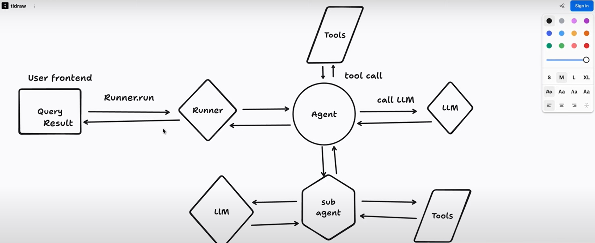
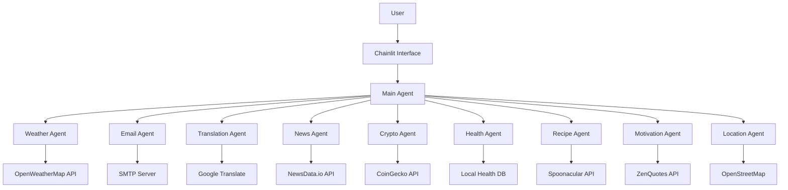

# AI Assistant with Specialized Agents

A powerful AI assistant system built with multiple specialized agents, each handling specific tasks using various APIs and tools. The system uses Chainlit for the chat interface, Gemini for the underlying language model, and is built using the OpenAI Agent SDK for agent orchestration and tool management.

## 🚀 Features

### 1. Weather Agent
- Fetches real-time weather data
- Provides temperature, conditions, humidity, and wind speed
- Uses OpenWeatherMap API
- Example: "What's the weather in New York?"

### 2. Email Agent
- Sends emails via SMTP
- Supports HTML and plain text emails
- Uses Gmail SMTP server
- Example: "Send an email to john@example.com"

### 3. Translation Agent
- Translates text between languages
- Uses Google Translate API
- Supports multiple languages
- Example: "Translate 'Hello' to Spanish"

### 4. News Agent
- Fetches latest news
- Supports category-based news
- Uses NewsData.io API
- Example: "Show me technology news"

### 5. Cryptocurrency Agent
- Fetches real-time crypto prices
- Supports multiple cryptocurrencies
- Uses CoinGecko API
- Example: "What's the current Bitcoin price?"

### 6. Health Information Agent
- Provides health-related information
- Includes medication details
- Local database of common conditions
- Example: "What are common medications for headaches?"

### 7. Recipe Agent
- Finds recipes and cooking instructions
- Includes nutritional information
- Uses Spoonacular API
- Example: "How do I make pasta carbonara?"

### 8. Motivation Agent
- Provides motivational quotes
- Supports category-based quotes
- Uses ZenQuotes API
- Example: "Give me some motivational quotes"

### 9. Location Agent
- Calculates distances and routes
- Uses OpenStreetMap services
- Provides driving and straight-line distances
- Example: "What's the distance between Karachi and Lahore?"

## 🏗️ Architecture



## 🛠️ Technical Stack

- **Framework**: Chainlit
- **Language Model**: Gemini 2.0 Flash
- **Agent Framework**: OpenAI Agent SDK
- **Language**: Python 3.x
- **APIs Used**:
  - OpenWeatherMap
  - Gmail SMTP
  - Google Translate
  - NewsData.io
  - CoinGecko
  - Spoonacular
  - ZenQuotes
  - OpenStreetMap

## 📋 Prerequisites

- Python 3.x
- pip (Python package manager)
- API keys for various services
- Virtual environment (recommended)
- OpenAI Agent SDK

## 🔧 Installation

1. Clone the repository:
```bash
git clone <repository-url>
cd <repository-name>
```

2. Create and activate virtual environment:
```bash
python -m venv .venv
source .venv/bin/activate  # On Windows: .venv\Scripts\activate
```

3. Install dependencies:
```bash
pip install -r requirements.txt
pip install agents-sdk  # Install OpenAI Agent SDK
```

4. Create a `.env` file with your API keys:
```env
GEMINI_API_KEY=your_gemini_api_key
WEATHER_API_KEY=your_weather_api_key
NEWS_API_KEY=your_news_api_key
EMAIL_ADDRESS=your_email
EMAIL_PASSWORD=your_email_password
COINDESK_API_KEY=your_coindesk_api_key
SPOONACULAR_API_KEY=your_spoonacular_api_key
```

## 🚀 Usage

1. Start the application:
```bash
chainlit run main1.py
```

2. Open your browser and navigate to:
```
http://localhost:8000
```

3. Start chatting with the AI assistant!

## 🤖 Agent System

### Main Agent
- Built using OpenAI Agent SDK
- Acts as the coordinator
- Routes queries to specialized agents
- Handles general questions
- Manages conversation flow
- Implements function calling and tool management

### Specialized Agents
Each agent is designed for a specific task and is implemented using the OpenAI Agent SDK's function tools:

1. **Weather Agent**
   - Handles weather-related queries
   - Provides detailed weather information
   - Uses OpenWeatherMap API
   - Implements function tools for weather data retrieval

2. **Email Agent**
   - Manages email sending
   - Handles SMTP communication
   - Supports HTML formatting

3. **Translation Agent**
   - Handles language translation
   - Supports multiple languages
   - Uses Google Translate

4. **News Agent**
   - Fetches latest news
   - Supports category filtering
   - Uses NewsData.io API

5. **Cryptocurrency Agent**
   - Provides crypto prices
   - Supports multiple cryptocurrencies
   - Uses CoinGecko API

6. **Health Agent**
   - Provides health information
   - Includes medication details
   - Uses local database

7. **Recipe Agent**
   - Finds recipes
   - Provides cooking instructions
   - Uses Spoonacular API

8. **Motivation Agent**
   - Provides motivational quotes
   - Supports categories
   - Uses ZenQuotes API

9. **Location Agent**
   - Calculates distances
   - Provides route information
   - Uses OpenStreetMap

## 🔄 Workflow

1. User sends a message
2. Main Agent (using OpenAI Agent SDK) analyzes the query
3. Query is routed to appropriate specialized agent
4. Specialized agent processes the query using relevant tools
5. Response is formatted and sent back to user

## 📝 Example Queries

- Weather: "What's the weather in London?"
- Email: "Send an email to john@example.com"
- Translation: "Translate 'Hello' to French"
- News: "Show me latest technology news"
- Crypto: "What's the current Bitcoin price?"
- Health: "What are common medications for headaches?"
- Recipe: "How do I make chocolate cake?"
- Motivation: "Give me some motivational quotes"
- Location: "What's the distance between New York and Boston?"

## 🔒 Security

- API keys are stored in environment variables
- SMTP credentials are securely handled
- No sensitive data is stored locally

## 📄 License

This project is licensed under the MIT License - see the LICENSE file for details.

## 🔧 Development

### Using OpenAI Agent SDK

The project leverages the OpenAI Agent SDK for:
- Agent creation and management
- Function tool implementation
- Tool calling and execution
- Conversation flow control
- Error handling and retries

Example of agent creation:
```python
from agents import Agent, function_tool

@function_tool("weather")
def get_weather(city: str):
    # Weather tool implementation
    pass

weather_agent = Agent(
    name="Weather Agent",
    instructions="Use the weather tool for weather-related questions.",
    tools=[get_weather]
)
```

## 🙏 Acknowledgments

- Chainlit for the chat interface
- Google for Gemini model
- OpenAI for Agent SDK
- All API providers
- OpenStreetMap for location services

## 🤝 Contributing

Contributions are welcome! Please feel free to submit a Pull Request.

## Environment Variables

Make sure to set the following environment variable in your Hugging Face Space:
- `GEMINI_API_KEY`: Your Gemini API key

## How to Use

1. The application will be available at the URL provided by Hugging Face Spaces
2. Simply start chatting with the AI assistant
3. The interface is intuitive and user-friendly

## Setup Instructions

1. Create a `.env` file in the root directory and add your Gemini API key:
```
GEMINI_API_KEY=your_api_key_here
```

2. Install dependencies:
```bash
pip install -r requirements.txt
```

3. Run the application locally:
```bash
chainlit run main.py
```

## Deployment Options

### Option 1: Deploy to Railway
1. Create a Railway account at https://railway.app
2. Install Railway CLI: `npm i -g @railway/cli`
3. Login to Railway: `railway login`
4. Initialize project: `railway init`
5. Deploy: `railway up`

### Option 2: Deploy to Render
1. Create a Render account at https://render.com
2. Create a new Web Service
3. Connect your GitHub repository
4. Set build command: `pip install -r requirements.txt`
5. Set start command: `chainlit run main.py`
6. Add environment variable: `GEMINI_API_KEY`

### Option 3: Deploy to Heroku
1. Create a Heroku account
2. Install Heroku CLI
3. Create `Procfile` with: `web: chainlit run main.py`
4. Deploy using Heroku CLI or GitHub integration
